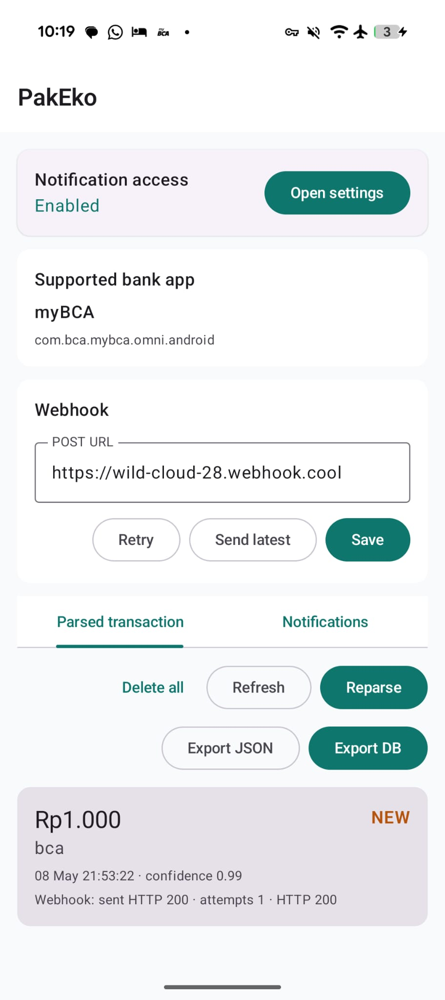

# PakEko

Most people doesn't need payment gateway, my gut feeling is that most of them (online store owners) only need a way to get notification if somebody paid an order. In this repo, we are going to create a proof of concept that by listening to bank app notification, we can achieve the same result.

Code is generated 100% by Codex.



## Why my bank is not supported?

Look at `/app/src/main/java/id/local/transfermonitor/util/MyBcaNotificationTemplates.kt` and tell your clankers to build one for you.

## Development shell

Enter the pinned Android development environment:

```sh
nix develop
```

If you use `direnv`:

```sh
direnv allow
```

The shell provides:

- JDK 17
- Gradle
- Kotlin
- Android SDK platforms 35 and 36
- Android build tools 35.0.0
- Android platform tools

## Build

```sh
nix develop
gradle assembleDebug
```

The debug APK is written to:

```text
app/build/outputs/apk/debug/app-debug.apk
```

Install it on a connected Android device:

```sh
adb install -r app/build/outputs/apk/debug/app-debug.apk
```

Open **PakEko**, enable notification access in Android settings, then watch the local Parsed transaction and Notifications tabs.

## License

MIT
